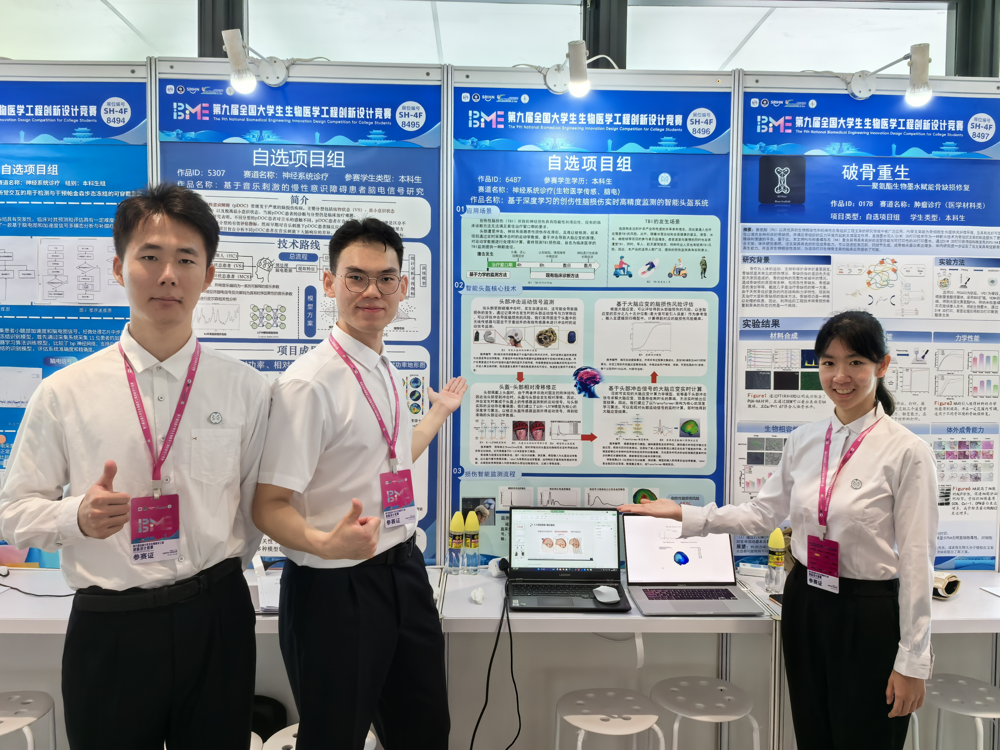
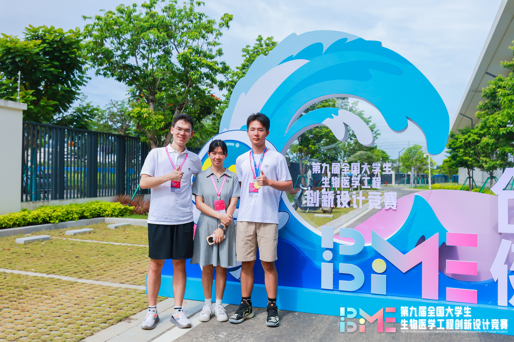

<!--more-->

In July 2024, three members of the Yuzhe Liu Research Group — Zhilan Zheng, Kaiwen Xing, and Shengtao Jiang — participated in the 9th National Undergraduate Biomedical Engineering Innovation and Design Competition held in Sanya, Hainan, under the guidance of Professor Yuzhe Liu. Competing in the Neurological Diagnosis and Treatment track, the team stood out with their innovative project, “An Intelligent Helmet System for Real-Time, High-Precision Monitoring of Traumatic Brain Injury Based on Deep Learning,” and was awarded the First Prize for their outstanding performance and creativity.

2024年7月，课题组郑芷兰、邢凯文、蒋圣涛三位同学在刘雨喆老师的指导下参加了在海南三亚举办的第九届全国大学生生物医学工程创新设计竞赛。参赛团队凭借“基于深度学习的创伤性脑损伤实时高精度监测的智能头盔系统”在神经系统诊疗赛道荣获一等奖。

